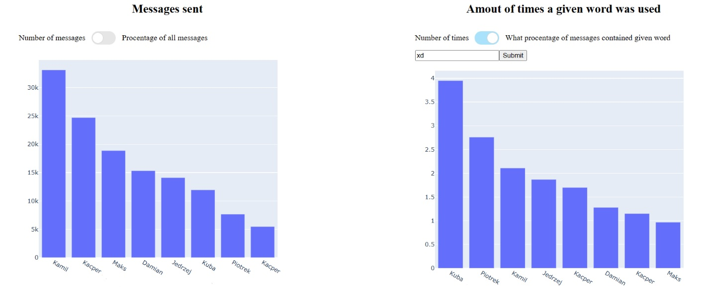
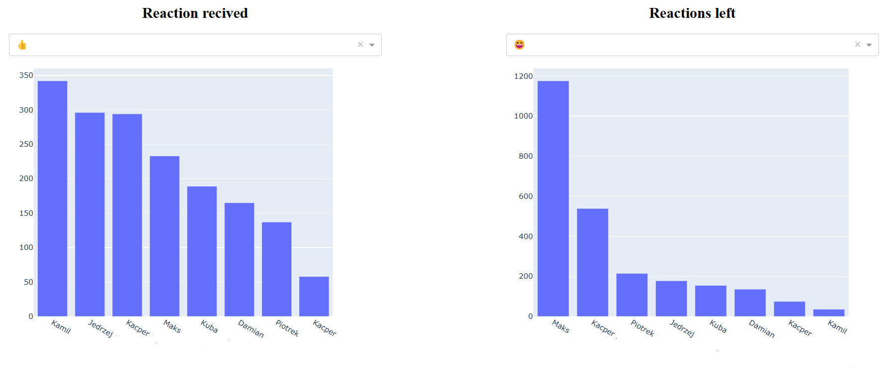
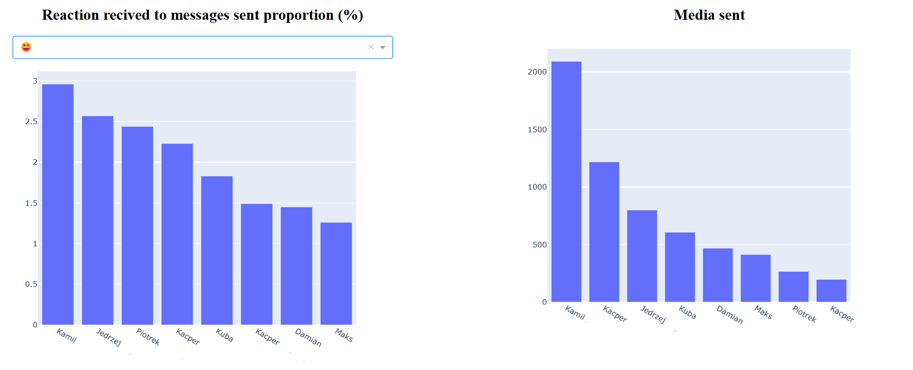
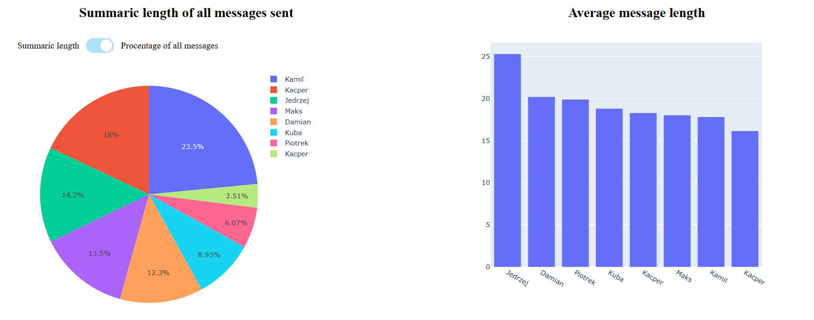

# Statistics for Messanger conversation

Date of creation: 18.02.2023

Program that allows extraction and visualisation of statistics from conversations on Messanger.

It works on .json files provided by Facebook that you can get following this guide https://www.facebook.com/help/messenger-app/713635396288741.

Program provides statistics for:
* The amount of messages sent in the conversation
* All the times a given word was used
* The amount of reactions left and recived under messages
* Most used words in the conversation
* Proportions of reactions recived to messages sent
* The amount of media sent (photos/videos)
* Summaric length of all messages (in characters)
* Average message length for each participant
* List of messages with the most reactions by each participant

To run it you need to download the files and navigate to the folder that contains the conversation you're intrested in (messages->inbox->*conversation_name*).
Next, move all the *message_x.json* files into provided *messages* folder. After that (assuming you have Python installed) run the program by writting *python msgStatsVisualisation.py* then click on the link provided in the console. You might need to download some libraries, in that case check the dependecies section.

Dependencites:
- Python 3.9.0
- dash v2.8.1
- ftfy v6.1.1
- plotly v5.13.0

It might work with other versions but it was tested and created using those above.

Possible upgrades:
- Allow the user to chose the folder with files containig message logs
- Allow to view data based on time periods
- Add some diagrams showing changes in time

Preview:

 
 
 
 